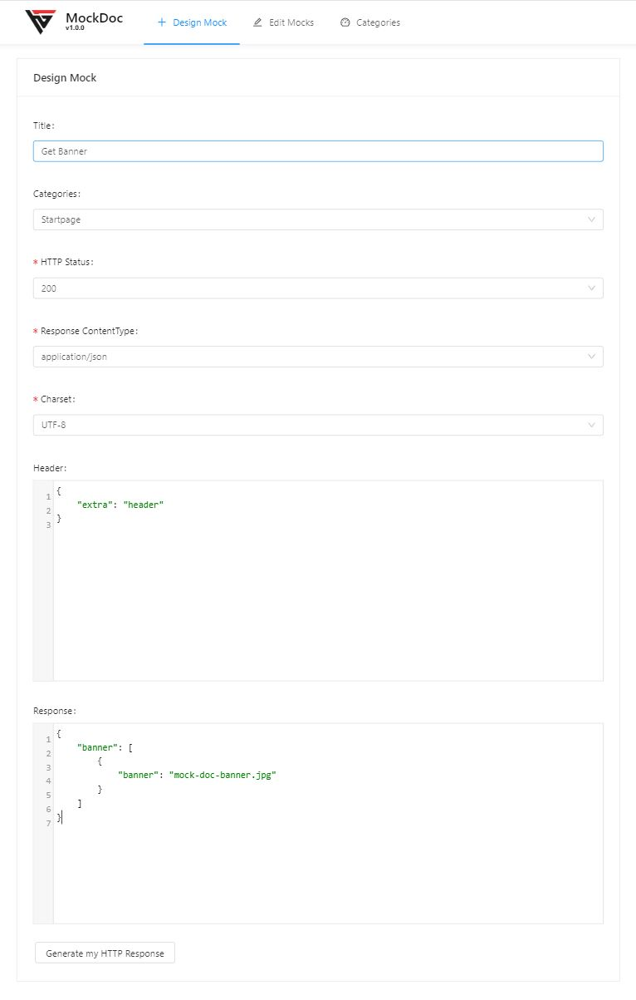

# MockDoc


[Powered by Hangar/Antd-Components](https://anh4n.github.io/antd-components/#/)

# Description

MockDoc generates custom API responses for your project.
You can fully manage your mocks and customize them. They were stored in a mongo database.

#### RUN

```
$ docker run -it --rm \
    --name mockdoc \
    -p 3000:3000 \
    -e MONGO_SERVER="mongo" \
    -e MONGO_DATABASE="your-db-name" \
    -e MONGO_USER="user" \
    -e MONGO_PASSWORD="fairly long password" \
    -e MONGO_PORT="27017" \
    -e MONGO_AUTH="true" \
    mockdoc
```

# Environments

Name              | Description             |  Default |
----------------- |------------------------ |-----------
MONGO_SERVER      |  Mongodb Server Address |
MONGO_DATABASE    |  Mongodb Database Name  |
MONGO_USER        |  Mongodb Username       |
MONGO_PASSWORD    |  Mongodb Password       |
MONGO_PORT        |  Mongodb Port           | 27017
MONGO_AUTH        |  Authentication enabled | true

# Tool



# Usage

```bash
$ curl https://localhost:3000/mock/5eef767754b2a300bfa9de08
< HTTP/1.1 200 OK
< Content-Type: application/json; charset=UTF-8
{"banner":[{"banner":"mock-doc-banner.jpg"}]}
```

# Quick Mock Edit
If you want edit your mock quickly without searching it in the database, just add "edit" at the end of the url and open it in your browser. The edit form for your mock will be opend in the tool.

##### Example
https://localhost:3000/mock/5eef767754b2a300bfa9de08/edit
